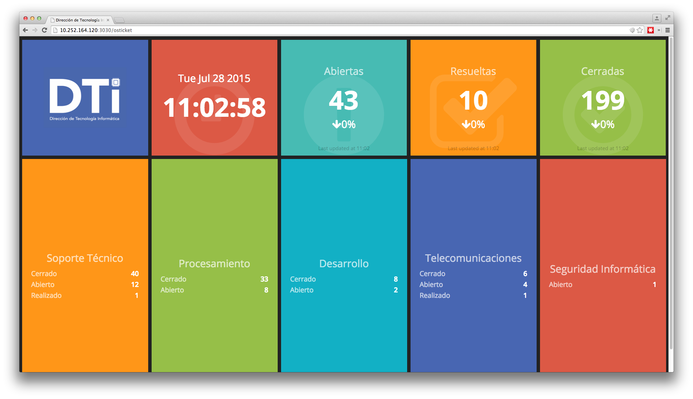

# IFARHU - Dashboard

This dashboard is implemented by using Shopify Dashing. Read more [here](http://dashing.io).

## How this works

[osTicket](http://osticket.com) is a great Open Source suport ticketing system, but it lacks of two things:

* Its API doesn't allow to consume much things (it only allows you to create new tickets, actually).
* Has a very basic Dashboard system.

We had to consume all the data from the database, using simple queries.

## How to use it

This project uses [dotenv](https://github.com/bkeepers/dotenv).

First, copy `.env.sample` to `.env`:

~~~
cp .env.sample .env
~~~

You will need to change your Database credentials under `.env` and also modify all the jobs under the `jobs` folder. Keep in mind that this project is only an example of usage.

Then, execute:

~~~
bundle
gem install dashing
~~~

This will download all the necessary gems. After this, you can execute the dashboard by typing:

~~~
dashing start
~~~

After a couple of seconds, you will see something similar to this:

~~~
Thin web server (v1.6.3 codename Protein Powder)
Maximum connections set to 1024
Listening on 0.0.0.0:3030, CTRL+C to stop
~~~

All done, go to `http://localhost:3030` and you'll see your new Dashboard. If you wish, you can install it as a service. [More information](https://gist.github.com/gregology/5313326).

## Credits

All credits to [Shopify, Dashing](https://github.com/Shopify/dashing).

IFARHU, Dirección de Tecnología Informática. 2015.